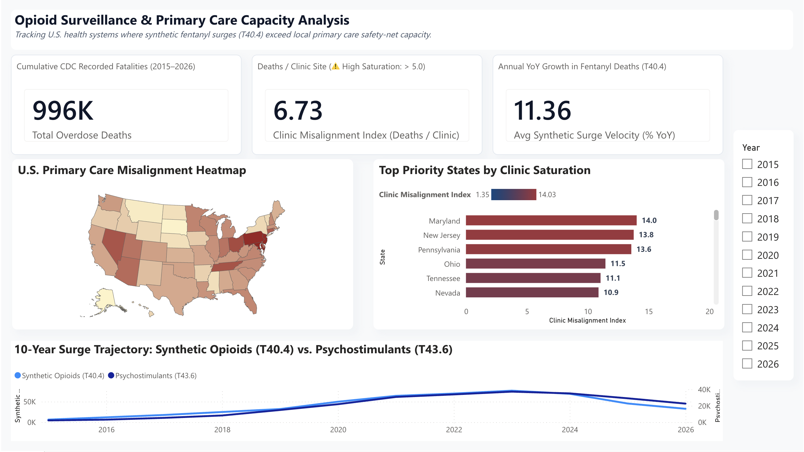

# Opioid Surveillance & Primary Care Capacity Analysis
### Mapping High-Risk Overdose Hotspots to Primary Care Clinic Support

[](file:///Users/JPENA/porfolio_project_001/scripts/01_ingest_data.R)
[](https://app.powerbi.com)
[](#domain-background--author)
[](#data-architecture--open-datasets)

---

## 📌 Executive Summary

Public health overdose prevention programs face a critical structural friction point: **illicit synthetic fentanyl surges (`T40.4`) and polysubstance stimulant co-use (`T43.6`) are accelerating faster than local primary care safety-net infrastructure can adapt.**

This project bridges **doctoral-level addiction neurobiology** and **epidemiological surveillance** to analyze official open-access government datasets from the **CDC** and **HRSA**. By engineering a reproducible R data pipeline and an interactive Power BI decision-intelligence dashboard, this portfolio piece identifies states where overdose mortality mathematically saturates available Federally Qualified Health Center (FQHC) primary care sites.



---

## 👨‍🔬 Domain Background & Author

**Author**: **Dr. José I. Peña Bravo, PhD**  
*Neurophysiologist • Medical Educator • Healthcare Data Strategist*

* **PhD in Neuroscience** (Medical University of South Carolina): Investigated prefrontal cortex synaptic plasticity and neural circuit mechanisms underlying drug-seeking and relapse behavior.
* **Former Healthcare Data Analyst & Interim Program Manager** (Florida Dept. of Health in Duval County – CDC Overdose Data to Action / OD2A Program): Managed county-level EMS, ED utilization, and PDMP surveillance pipelines to direct community naloxone distributions and clinical education.

---

## 💡 Core Friction Point Metrics

Rather than presenting standard exploratory data analysis, this project engineers three custom decision metrics:

### 1. Clinic Catchment Misalignment Index
$$\text{Clinic Misalignment Index} = \frac{\text{Total Overdose Fatalities in Selected Period}}{\text{Total Active HRSA Primary Care Clinics}}$$
* **Friction Point**: Explicitly measures the burden on safety-net primary care providers. Identifies states where death counts are high relative to clinic density (e.g., Nevada at **15.5**, Maryland at **10.9**, and New Jersey at **10.8** deaths per clinic in 2024 vs. national benchmark of 2.1).

### 2. Synthetic Surge Velocity Metric (`T40.4`)
$$\text{Surge Velocity Pct} = \frac{\text{Fentanyl Deaths}_t - \text{Fentanyl Deaths}_{t-1}}{\text{Fentanyl Deaths}_{t-1}} \times 100$$
* **Friction Point**: Measures year-over-year acceleration of illicit synthetic opioids (`T40.4`) relative to general opioids, highlighting regions where mortality spikes outpace local clinical prescribing guidelines and budget allocations.

### 3. Polysubstance Cross-Over Index (`T43.6 / T40.4`)
$$\text{Polysubstance Cross-Over Index} = \frac{\text{Psychostimulant Deaths (T43.6)}}{\text{Synthetic Opioid Deaths (T40.4)}}$$
* **Friction Point**: Tracks the concurrent rise of methamphetamine/stimulant co-use within fentanyl hotspots. Highlights a severe capability gap in traditional primary care clinics structured around single-substance protocols.

---

## 🔬 Epidemiological Surveillance Framework (ICD-10)

| ICD-10 Code | Official Category Description | Clinical & Surveillance Context |
|---|---|---|
| **`T40.4`** | Synthetic opioids, excluding methadone | Primary surveillance marker for illicitly manufactured **fentanyl** and fentanyl analogs. |
| **`T43.6`** | Psychostimulants with abuse potential | Primary marker for **methamphetamine**, amphetamines, and prescription stimulants. Tracks stimulant/opioid co-use. |
| **`T40.0–T40.4, T40.6`** | All Opioids | Comprehensive opioid category covering opium, heroin, natural/semi-synthetic opioids (oxycodone/hydrocodone), methadone, and synthetic opioids. |
| **`X40–X44, X60–X64, X85, Y10–Y14`** | Underlying Overdose Cause of Death | Standard CDC aggregate measure for acute drug poisonings (unintentional, suicide, homicide, undetermined). |

---

## 🛠️ Data Architecture & Pipeline Methodology

```
┌────────────────────────────────────────────────────────┐
│ 1. Raw Data Ingestion (scripts/01_ingest_data.R)        │
│ - Automated download of CDC VSRR Provisional Data      │
│ - HRSA Health Center Program Site Directory            │
└───────────────────────────┬────────────────────────────┘
                            │
                            ▼
┌────────────────────────────────────────────────────────┐
│ 2. Methodological Cleaning (scripts/02_clean_data.R)   │
│ - Isolates Month == "December" for clean calendar years│
│ - Preserves NA privacy suppression flags (counts 1-9)  │
└───────────────────────────┬────────────────────────────┘
                            │
                            ▼
┌────────────────────────────────────────────────────────┐
│ 3. Friction Metrics Computation (scripts/03_advanced...)│
│ - Calculates Surge Velocity, Polysubstance Index, and  │
│   Clinic Catchment Misalignment ratios per state-year  │
└───────────────────────────┬────────────────────────────┘
                            │
                            ▼
┌────────────────────────────────────────────────────────┐
│ 4. Power BI Interactive Dashboard (app.powerbi.com)    │
│ - Weighted DAX Measures, Shape Heatmap, Line Trends   │
└───────────────────────────┬────────────────────────────┘
```

### Methodological Rigor & Data Quality Controls
1. **Calendar-Year Isolation (`Month == "December"`)**: The CDC VSRR reports 12-month trailing totals every month. To prevent overlapping 12-month window distortions, the cleaning script filters specifically for `Month == "December"` to cleanly isolate non-overlapping January–December annual totals.
2. **Privacy Suppression Preservation**: Counts of 1–9 deaths are suppressed by the CDC for privacy and reported as `NA`. Rather than converting `NA` to `0` (which artificially lowers regional risk baselines), suppressed records are explicitly flagged (`is_suppressed`) and preserved as missing values.
3. **Explicit DAX Weighted Ratios**: To avoid summing non-additive ratios in Power BI, clinic misalignment is calculated using explicit DAX measures:
```dax
Clinic Misalignment Index = 
DIVIDE(
    SUM('advanced_friction_summary'[total_overdose_deaths]),
    SUM('advanced_friction_summary'[hrsa_clinic_count]),
    BLANK()
)
```

---

## 📂 Project Repository Structure

```
porfolio_project_001/
├── data/
│   ├── clean_state_overdose_summary.csv # Cleaned December Calendar-Year Summary
│   └── advanced_friction_summary.csv    # Final Dashboard Data File with Friction Metrics
├── scripts/
│   ├── 01_ingest_data.R                 # R Script: Automated Dataset Download & Inspection
│   ├── 02_clean_data.R                  # R Script: December Filtering & Suppression Control
│   └── 03_advanced_friction_metrics.R   # R Script: Friction Metrics & HRSA Spatial Joins
├── docs/
│   ├── icd10_documentation.md           # ICD-10 Surveillance & Metric Reference
│   └── powerbi_dashboard_blueprint.md   # Visual Wireframe & DAX Specification
├── image.png                            # Power BI Dashboard Final Screenshot
├── project_journal.md                   # Development Time & Activity Log
├── .gitignore                           # Git Exclusion Configuration
└── README.md                            # GitHub Project Portfolio Master Readme
```

---

## ⚡ How to Reproduce

### 1. Run the R Data Pipeline
Ensure R (version 4.4+) and the `tidyverse` package are installed. Run the scripts in sequence:

```bash
Rscript scripts/01_ingest_data.R
Rscript scripts/02_clean_data.R
Rscript scripts/03_advanced_friction_metrics.R
```

### 2. Load into Power BI
1. Open [Power BI Web Service](https://app.powerbi.com).
2. Upload [`data/advanced_friction_summary.csv`](file:///Users/JPENA/porfolio_project_001/data/advanced_friction_summary.csv).
3. Create the DAX measure `Clinic Misalignment Index` and assemble visuals following [`docs/powerbi_dashboard_blueprint.md`](file:///Users/JPENA/porfolio_project_001/docs/powerbi_dashboard_blueprint.md).

---

## 📜 License & Acknowledgments

* **Data Sources**: Official open data provided by the **Centers for Disease Control and Prevention (CDC)** and the **Health Resources and Services Administration (HRSA)**.
* **Author Contact**: Dr. José I. Peña Bravo ([LinkedIn](https://linkedin.com/in/josepenabravo) | [GitHub](https://github.com/jpenabravoj00))
